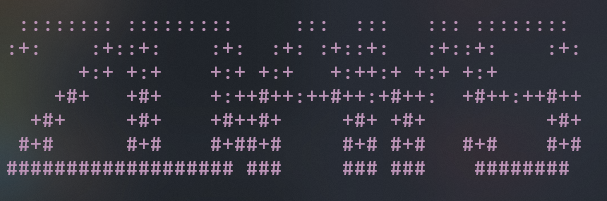
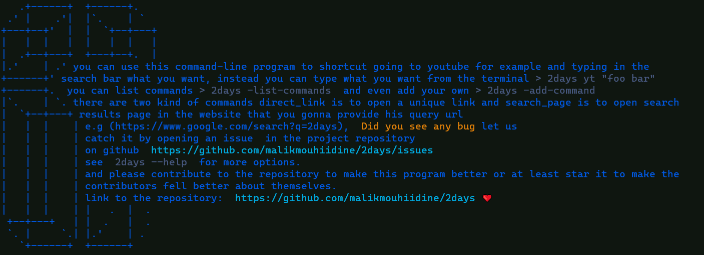

# 2days



## Table of Contents

- [About](#about)
- [Getting Started](#getting_started)
- [Usage](#usage)
- [My recommended commands](#recommended)
<!-- - [Contributing](../CONTRIBUTING.md) -->

## About 2days<a name = "about"></a>

You can use this command-line program to shortcut going to youtube for example and typing in the search bar what you want, instead, you can just type in the terminal `> 2days yt "foo bar"` and press enter. or you may be like me you have thousands of bookmarks in your default browser and you always go search to that one link, that bad for you're productivity, what you want to do instead is to:

<pre>
> 2days -add-command
> type of the command (direct_link, search_page): <b>direct_link</b>
> name of the command: <b>my_link</b>
> what's the link: <b>https://www.example.com/foo</b>
</pre>

now just type: `> 2days my_link` and here you are!

maybe it's hard for you to relate to that story, what about StackOverflow?
you're getting this error in your terminal you copy it and..! ok we where this is going, instead just copy it and `> 2days stv "my ugly error"` and here is the StackOverflow page result to find what you need. ok, that's good but maybe not enough for you, What I want to add my own search command on another website? YOU can do that! just like before:

<pre>
> 2days -add-command
> type of the command (direct_link, search_page, local_folder/file): <b>search_page</b>
> name of the command: <b>g</b>
> what's the query_url: <b>http://www.google.com/search?q=</b>
</pre>

and now every time you want to search google just `> 2days g "foo bar"`, So this is the idea of 2days command-line program.

**Note**: the `g` google command is preconfigured

Further more you can shortcut going to the location and opening a file or folder to just one command `> 2days my_folder` or `> 2days my_file`, and you can add this command just like the aboves.

## Getting Started <a name = "getting_started"></a>

These instructions will get you a copy of the project up and running on your local machine for usage, development, and testing purposes.

### Prerequisites

No prerequisites, if you have python 3 installed you have everything you need to run the program.

If you don't have python installed here is the official [downloads page](https://www.python.org/downloads/)

### Installing

1- Git clone the project or zip download it

2- Move the program to the directory you wanted to be in.

3- Go to the `helpers.py` file and change the path that you find to the `dictionaries.json` file that it's in the same directory and if you use windows make sure to escape the `\` character by doubling it `\\`.

4- At this point, you can run the program from the terminal `> py main.py [<argument>] ...` but you should be in the project directory and that's not what we want so?

5- if you're using **Mac os** or **Linux**:
open you're ./bashrc file or ./zshconfig if you're using zsh, and add an alias

```
alias 2days='py [<path to the main.py file>]'
```

and now you can use the `$ 2days` command wherever you want.

else if you're using **windows**:

in **Powershell** paste this snippet of code:

```
# Create profile when not exist
if (!(Test-Path -Path $PROFILE.CurrentUserAllHosts)) {
  New-Item -ItemType File -Path $PROFILE.CurrentUserAllHosts -Force
}

# Open the profile with an editor (e.g. good old Notepad)
ii $PROFILE.CurrentUserAllHosts
```

now in the editor paste this to add a function:

```
function 2days { & py [<path to the main.py file>] $args }
```

and now you can use the `> 2days` command wherever you want.

## Usage <a name = "usage"></a>

read the [About](#about) section and the Intro and you know how to use the program. have fun 😀



## My recommended commands<a name = "recommended"></a>

I added already some pre-configured commands,
I hope that you like them.
